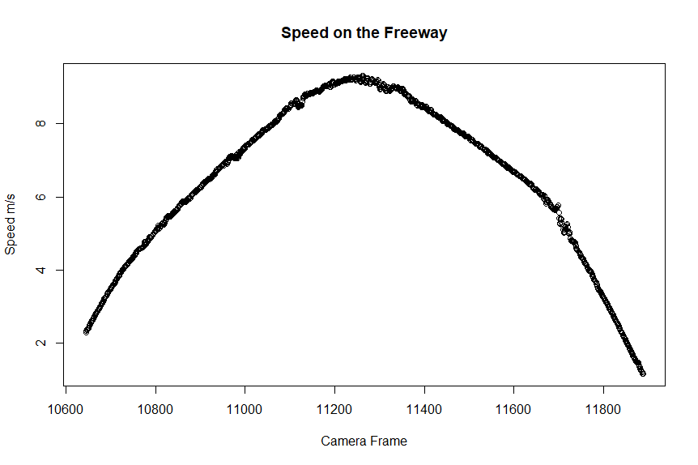
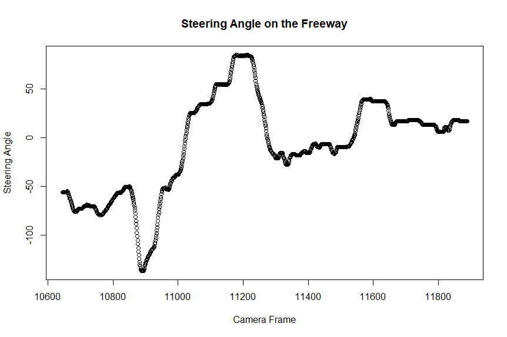

# Comma.ai Dataset Analysis Statistics

Statistics Project using the R language to analyze values of a vehicle such as speed, steering torque, and Brake Depression. Vehicle Value in the calculation of what a self-driving car will do when put in different scenarios, an example of what the Comma team has done with the comma two.

